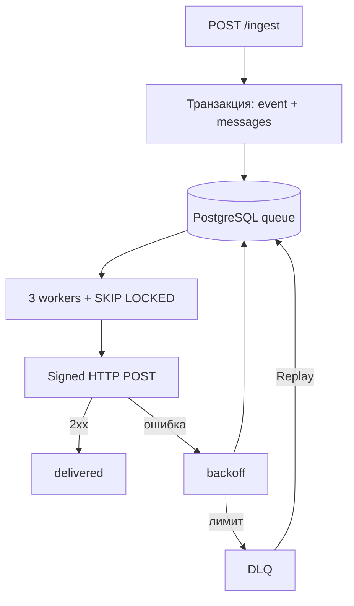

# Hookline

Self-hosted сервис гарантированной доставки вебхуков на Go и PostgreSQL.

[](https://github.com/hookline-dev/hookline/actions/workflows/ci.yml)

## Возможности

- атомарный ingest и fan-out по `exact`, `prefix.*`, `*`;
- PostgreSQL queue: `SKIP LOCKED`, lease и reaper;
- HMAC-SHA256, raw-body delivery и constant-time verify;
- backoff + full jitter, DLQ, Replay и circuit breaker;
- GitHub ingest и Telegram dogfooding adapter;
- 4 экрана dashboard, Prometheus и Grafana;
- режимы `api`, `worker`, `all`.

## Быстрый старт

```bash
git clone https://github.com/hookline-dev/hookline
cd hookline
cp .env.example .env
make up
make demo
```

Dashboard: <http://localhost:8080>, Grafana: <http://localhost:3000>, sink:
<http://localhost:9090/received>. Админские маршруты требуют Bearer key.



```bash
make test
make test-integration
make cover
make lint
```

Полная автоматическая проверка перед релизом запускает тесты, отдельный Compose
стенд, проверку трёх workers в Prometheus, Grafana dashboard, восстановление
очереди после `SIGKILL` и нагрузочный прогон по критериям ТЗ:

```bash
make release-verify
```

Команда использует отдельный Compose project и удаляет его тестовые контейнеры и
volume после завершения. Чтобы оставить стенд для диагностики, запустите
`HOOKLINE_RELEASE_KEEP_STACK=1 make release-verify`.

Контракт: [OpenAPI](docs/api/openapi.yaml), гарантии:
[delivery-spec](docs/delivery-spec.md), [нагрузочная проверка](docs/performance.md),
[чек-лист релиза](docs/release-checklist.md), полное [ТЗ](docs/TZ.md).

Для GitHub → Telegram заполните Telegram-переменные в `.env`, запустите профиль
`dogfood`, создайте endpoint `http://telegram-sink:9092/hook` и подписку
`github.*`. При создании приложения передайте собственный
`githubWebhookSecret` длиной не менее 16 символов и укажите то же значение в
настройках GitHub; API никогда не возвращает этот секрет. Доставка —
**at-least-once**; порядок не гарантируется, получатель
дедуплицирует по `X-Hookline-Id`.
